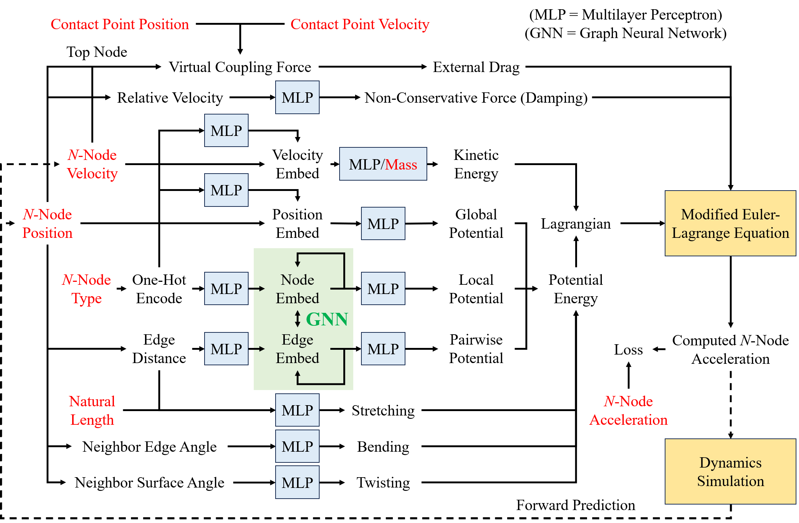

# Learning-Based Modeling of Lifted Object Dynamics for Haptic Rendering

This repository is the official implementation of the project "Learning-Based Modeling of Lifted Object Dynamics for Haptic Rendering". It includes codes for the two main components of the system: folder [LGNN_modified](https://github.com/Katsumi44/LiftedDynamics/tree/main/LGNN_modified) for Lagrangian-based dynamic modeling and folder [haptic_rendering](https://github.com/Katsumi44/LiftedDynamics/tree/main/haptic_rendering) for real-time haptic rendering.

The modified Lagrangian Graph Neural Network (LGNN) is based on the original LGNN [paper](https://proceedings.neurips.cc/paper_files/paper/2022/file/c0a9c840d651c295c095dad40e06fed9-Paper-Conference.pdf) and [codes](https://github.com/M3RG-IITD/LGNN/tree/ef932dbf3c9dcab8bb5ca4483e764ab158a8beac) written by Bhattoo et al. The contributions of this project are clarified below.

## Table of Contents

- [System Overview](#system-overview)

- [Lagrangian-Based Dynamic Modeling](#lagrangian-based-dynamic-modeling)

- [Haptic Rendering (Real-Time Computation)](#haptic-rendering-real-time-computation)

- [Citation](#citation)

- [Contact](#contact)

## System Overview

This project proposes a system that first leverages a modified LGNN to learn object dynamics from data collected during arbitrary lifting and shaking motion input. Soft-body-related modeling terms, including stretching, bending, and damping, are newly added to enable dynamic modeling for soft and deformable objects. Virtual coupling is also implemented to input the arbitrary lifting and shaking motion into the virtual object model. During real-time haptic rendering, the system utilizes the learned object dynamics to predict how the virtual object will evolve according to the user's motion input. Meanwhile, the haptic force feedback is computed via virtual coupling and rendered in real-time, generating a realistic haptic sensation of lifting and shaking a virtual object.

The main contributions of this project include:

- Incorporation of mass-spring-damper models in LGNN, which includes stretching, bending, and damping, as well as modifications of the network architecture to enable simulation and modeling of soft-body dynamics.

- Incorporation of virtual coupling in LGNN to enable haptic interactions between the user and the virtual object, i.e., inputting the user's lifting and shaking motions to the virtual object, and computing the passive force feedback generated by the object's dynamics, which should be delivered back to the user.

- Real-time haptic rendering of lifted virtual objects with an update rate exceeding 620 Hz, which is proven to be imperceptible to humans.

- Automatic dataset collection and preparation for learning the dynamics of real-world objects, particularly soft and deformable objects.

## Lagrangian-Based Dynamic Modeling

### Overview

The Lagrangian-based dynamic modeling part is responsible for learning object dynamics from data collected during arbitrary lifting and shaking motion input (especially for soft and deformable objects).

The target object can be either a simulated object, which has its parameters predefined based on the dynamics simulation system, or a real-world object, using a computer vision system (e.g., a binocular vision system) to track the motion (trajectory) of the markers attached to the object. Although the core code for machine learning is mostly the same, the data collection (obtaining trajectory data from simulation or directly importing from files) and the data preprocessing parts differ significantly. Thus, the code is separated into two files: [main_SimulatedObject](https://github.com/Katsumi44/LiftedDynamics/blob/main/LGNN_modified/scripts/main_SimulatedObject.py) and [main_RealObject](https://github.com/Katsumi44/LiftedDynamics/blob/main/LGNN_modified/scripts/main_RealObject.py).

The core machine learning component is the modified LGNN. The modifications made in this project include parts related to virtual coupling, damping, stretching, bending, and twisting (the latter not used in practice). Other components follow the settings in the original LGNN [paper](https://proceedings.neurips.cc/paper_files/paper/2022/file/c0a9c840d651c295c095dad40e06fed9-Paper-Conference.pdf) and [code](https://github.com/M3RG-IITD/LGNN/tree/ef932dbf3c9dcab8bb5ca4483e764ab158a8beac) written by Bhattoo et al.

### Dependencies

The Python programs [main_SimulatedObject](https://github.com/Katsumi44/LiftedDynamics/blob/main/LGNN_modified/scripts/main_SimulatedObject.py) and [main_RealObject](https://github.com/Katsumi44/LiftedDynamics/blob/main/LGNN_modified/scripts/main_RealObject.py) are run in the environment of Microsoft Windows 10 and Python 3.9.13. External libraries that need to be installed, along with the versions used by this project, are listed below:

- `fire==0.6.0`
- `matplotlib==3.9.0`
- `jraph==0.0.6.dev0`
- `numpy==1.26.4`
- `pandas==2.2.2`
- `scipy==1.12.0`
- `scikit-learn==1.5.0`
- `jax==0.4.23`
- `jaxlib==0.4.23`
- `jax-md==0.2.8`

To install these packages, use the following command in the directory of [LGNN_modified](https://github.com/Katsumi44/LiftedDynamics/tree/main/LGNN_modified):

`pip install -r requirements.txt`

### Usage

Before running the code, check and modify the settings for the global variables. Refer to the variable names and code comments to understand the meanings of the settings. Below are explanations for some key settings:

- When setting `use_stretching=True`, the stretching term will be enabled. Otherwise, rigid constraints will be used for the edges, i.e., the edge distances will be constrained to maintain the initial edge distances. Other terms, including bending, twisting, damping, and virtual coupling, are all independent of each other.

- When using the simulated object scenario, some typical object settings are predefined in the code:

    - `use_object=1` represents a basic object with 5 nodes, as well as standard and fixed masses, lengths, and stiffness, mimicking a typical sausage-like soft and deformable object.
    - `use_object=2` represents a heavier object, i.e., with larger masses.
    - `use_object=3` represents a longer object, i.e., with larger lengths.
    - `use_object=4` represents a stiffer object, i.e., with larger stiffness coefficients for stretching and bending.
    - `use_object=5` represents a complex object with 8 nodes, varying stiffness and damping for each edge, and nonlinear deformation (i.e., the stiffness changes according to the deformation).

- When using the real-world object scenario, it is important to set the basic scales of the stiffness and damping coefficients to match the object's condition. This helps the network find a more accurate and stable model to describe the object dynamics in the large exploration space.

- To learn the dynamics, set `execute_learn=True`. The learned model will be saved as a file named `lgnn_trained_model_True_0.dil`.

- Set `execute_test=True` to execute tests for evaluating the learned model, which include frequency sweep, magnitude sweep, and scale sweep. The model path should be assigned to the variable `model_trained_path`, and the test results will be saved as CSV files.

To obtain visualizations of the test results, place the CSV files in the [tests](https://github.com/Katsumi44/LiftedDynamics/tree/main/LGNN_modified/tests) folder and run the MATLAB program [test_plot](https://github.com/Katsumi44/LiftedDynamics/blob/main/LGNN_modified/tests/test_plot.m). For the first-time loading of data, or when overwriting the loaded data is necessary, set `load_data=true`, and the program will automatically scan the CSV files and save the data as a cell.

### Dataset Preparation (Data Collection)

#### Simulated Objects

For simulated objects, datasets are generated in the program [main_SimulatedObject](https://github.com/Katsumi44/LiftedDynamics/blob/main/LGNN_modified/scripts/main_SimulatedObject.py) before the learning process, using the dynamics simulation system based on the `jax-md` library.

#### Real-World Objects

For real-world objects, the CSV files containing the training and test datasets must first be imported into the program [main_RealObject](https://github.com/Katsumi44/LiftedDynamics/blob/main/LGNN_modified/scripts/main_RealObject.py). This project proposes a data collection system that automatically gathers these datasets from real-world objects. The system includes: a 3D-printed handheld knob with a force sensor (Robotiq FT300-S force torque sensor) attached at the bottom, with the object fixed below the force sensor; five markers attached to the object and four markers connected to the handheld knob; an OptiTrack V120:Duo binocular vision system for tracking the trajectory of the markers; and data collection software on a computer to collect, process, and save the data.

The data collection software consists of two parts: a custom Python program [main_DataCollect](https://github.com/Katsumi44/LiftedDynamics/blob/main/LGNN_modified/datasets/main_DataCollect.py) and the Motive software used for OptiTrack cameras. The process for collecting data is as follows:

1. Ensure that the OptiTrack V120:Duo binocular vision system and the Robotiq FT300-S force torque sensor are connected to the computer.

2. Download the Motive software from [OptiTrack's official platform](https://optitrack.com/support/downloads/motive.html).

3. Adjust the camera parameters in the Motive software to ensure that the markers are clearly visible in both the left and right camera images against the background.

4. Select the five markers on the sample object to create a marker set, and use the four markers rigidly connected to the handheld knob to create a rigid body (and another marker set).

5. Enable streaming mode in the Motive software and run the Python code [main_DataCollect](https://github.com/Katsumi44/LiftedDynamics/blob/main/LGNN_modified/datasets/main_DataCollect.py), developed for this project.

6. After hearing a beep from the computer, start shaking the sample object until the next beep is heard. The data will be saved in a CSV file, with the following units: mm for position, s for time, Hz for frequency, N for force, and Nm for torque.

The Python program [main_DataCollect](https://github.com/Katsumi44/LiftedDynamics/blob/main/LGNN_modified/datasets/main_DataCollect.py) is run in the environment of Microsoft Windows 10 and Python 3.9.7. External libraries that need to be installed, along with the versions used by this project, are listed below:

- `libscrc==1.8.1`
- `minimalmodbus==2.1.1`
- `pyserial==3.5`
- `setuptools==68.2.0`
- `wheel==0.41.2`

To install these packages, use the following command in the directory of [LGNN_modified/datasets](https://github.com/Katsumi44/LiftedDynamics/tree/main/LGNN_modified/datasets):

`pip install -r requirements.txt`

The Python program [main_DataCollect](https://github.com/Katsumi44/LiftedDynamics/blob/main/LGNN_modified/datasets/main_DataCollect.py) is based on the NatNet SDK, which can be downloaded from [OptiTrack's official platform](https://optitrack.com/support/downloads/developer-tools.html#natnet-sdk), and the sample Python program for extracting measurement data from the Robotiq FT300, available in [the GitHub repository created by the Robotiq community](https://github.com/castetsb/pyFT300). The basic functions are inherited, and the modifications in this project primarily focus on ensuring that data from OptiTrack and data from the force sensor are collected simultaneously for each time step, as well as saving the desired data with the appropriate units and formats.

## Haptic Rendering (Real-Time Computation)

### Overview

The haptic rendering part is responsible for capturing the user's lifting and shaking motion, calling the learned model to compute how the virtual object will evolve due to the motion input, and determining the passive force feedback that should be rendered back to the user according to the object dynamics. All computations are executed in real-time, with an overall system update rate tested to exceed 620 Hz, which has been proven to be imperceptible to humans.

### Dependencies

Install the [OpenHaptics](https://www.3dsystems.com/haptics-devices/openhaptics) developer software and include the installed libraries in a created C++ project with the [main_haptic](https://github.com/Katsumi44/LiftedDynamics/blob/main/haptic_rendering/main_haptic.cpp) program.

### Usage

This project utilizes the Touch X haptic device from 3D Systems Corporation. Since the haptic device is controlled using C++ programming, while the learned dynamic model is implemented in Python, this project leverages User Datagram Protocol (UDP) for server-client communication to transmit data between the local C++ and Python programs.

Steps for running the real-time haptic rendering are as follows:

1. Use the __Touch Smart Setup__ software provided by 3D Systems Corporation to calibrate the Touch X haptic device and save the calibration configuration.

2. __Run the C++ program [main_haptic](https://github.com/Katsumi44/LiftedDynamics/blob/main/haptic_rendering/main_haptic.cpp)__, which initializes the position of the haptic stylus to a predefined center and creates a UDP client.

3. In the Python program [main_SimulatedObject](https://github.com/Katsumi44/LiftedDynamics/blob/main/LGNN_modified/scripts/main_SimulatedObject.py) or [main_RealObject](https://github.com/Katsumi44/LiftedDynamics/blob/main/LGNN_modified/scripts/main_RealObject.py), set `execute_render=True` and set `model_trained_path` to the path where the trained model is located. After that, __run the Python program__, which will start the real-time computation loop. The program will then listen for new messages in the UDP communication.

4. When the user __clicks the button on the haptic stylus__, the running C++ program detects the button input and starts sending messages via UDP. The messages include warm-up messages at the beginning, followed by sending the positions of the user-held haptic stylus.

5. After receiving the messages, the running Python program computes the force feedback to be rendered and the object dynamics for the next time step, based on the received position representing the user's motion. The program then sends the force data via UDP and waits for a new UDP message for the next iteration.

6. Upon receiving the force data, the running C++ program renders the force back to the user via the haptic stylus and starts the next iteration of obtaining and sending position data.

7. When the user __clicks the button on the haptic stylus again__ after interacting for some time, the running C++ program will send a specific message denoting termination. The running Python program will then exit the real-time computation loop and proceed to __plot an animation of the virtual object's dynamics during the haptic interaction__. This provides the user with an intuitive understanding of what happened and how the object evolved.

8. __Close the C++ and Python programs__ to completely terminate the processes.

## Citation

TBD.

## Contact

This repository is created by Yutong Zhang (https://github.com/Katsumi44).

Please feel free to contact me via email: katsumi.zyt@gmail.com.