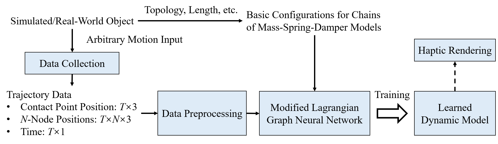
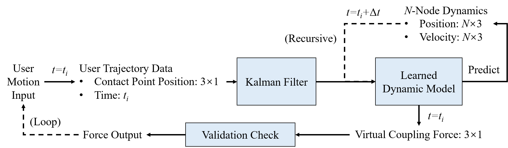

# Learning-Based Modeling of Lifted Object Dynamics for Haptic Rendering

This repository is the official implementation of the project "Learning-Based Modeling of Lifted Object Dynamics for Haptic Rendering". It includes code for the two main components of the system: [LGNN_modified](https://github.com/Katsumi44/LiftedDynamics/tree/main/LGNN_modified) for Lagrangian-based dynamic modeling and [haptic_rendering](https://github.com/Katsumi44/LiftedDynamics/tree/main/haptic_rendering) for real-time haptic rendering.

The modified Lagrangian Graph Neural Network (LGNN) is based on the original LGNN [paper](https://proceedings.neurips.cc/paper_files/paper/2022/file/c0a9c840d651c295c095dad40e06fed9-Paper-Conference.pdf) and [codes](https://github.com/M3RG-IITD/LGNN/tree/ef932dbf3c9dcab8bb5ca4483e764ab158a8beac) written by Bhattoo et al. The contributions of this project are clarified below.

## Table of Contents
- [System Overview](#system-overview)
- [Lagrangian-Based Dynamic Modeling](#lagrangian-based-dynamic-modeling)
- [Haptic Rendering (Real-Time Computation)](#haptic-rendering-real-time-computation)
- [Citation](#citation)
- [Contact](#contact)

## System Overview

This project proposes a system that first leverages a modified LGNN to learn object dynamics from data collected during arbitrary lifting and shaking motion input. Soft-body-related modeling terms, including stretching, bending, and damping, are newly added to enable dynamic modeling for soft and deformable objects. Virtual coupling is also implemented to input the arbitrary lifting and shaking motion into the virtual object model. During real-time haptic rendering, the system utilizes the learned object dynamics to predict how the virtual object will evolve according to the user's motion input. Meanwhile, the haptic force feedback is computed via virtual coupling and rendered in real-time, generating a realistic haptic sensation of lifting and shaking a virtual object.

The main contributions of this project include:

1. Incorporation of mass-spring-damper models in LGNN, which includes stretching, bending, and damping, as well as modifications of the network architecture to enable simulation and modeling of soft-body dynamics.

2. Incorporation of virtual coupling in LGNN to enable haptic interactions between the user and the virtual object, i.e., inputting the user's lifting and shaking motions to the virtual object, and computing the passive force feedback generated by the object's dynamics, which should be delivered back to the user.

3. Real-time haptic rendering of lifted virtual objects with an update rate exceeding 620 Hz, which is proven to be imperceptible to humans.

4. Automatic dataset collection and preparation for learning the dynamics of real-world objects, particularly soft and deformable objects.

## Lagrangian-Based Dynamic Modeling

## Haptic Rendering (Real-Time Computation)

## Citation

TBD.

## Contact

This repository is created by Yutong Zhang (https://github.com/Katsumi44).

Please feel free to contact me via email: katsumi.zyt@gmail.com.